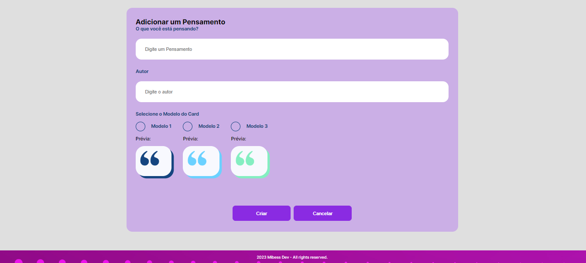
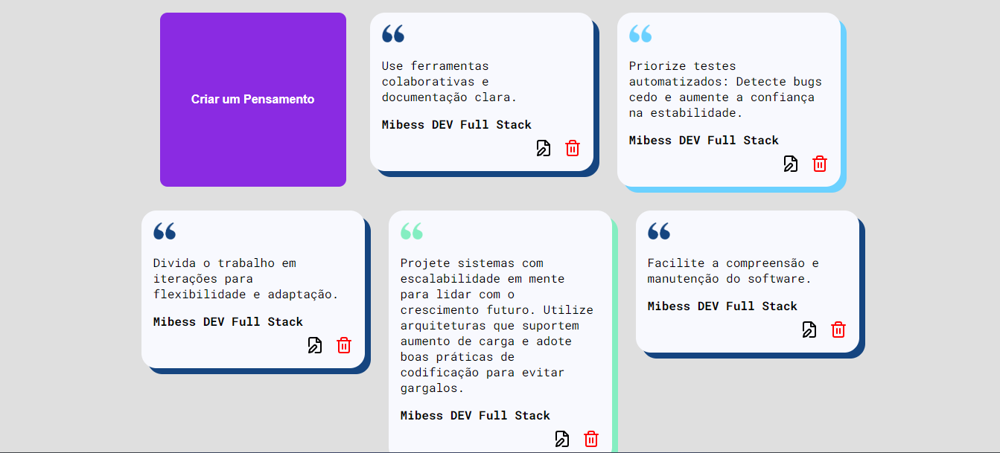

# Mibess Cards

## _Compartilhamento de Pensamentos_

Mibess Cards é uma simples aplicação feita com Angular para gerenciamento de pensamentos. Nela podemos cadastrar, editar e excluir um pensamento.

**Requisitos**

[Angular CLI](https://angular.dev/) versão >= 17.0.5.

[Node](https://nodejs.org/en) versão >= 20.10.0.

[Cards API](https://github.com/mibess/card-api) Aplicação backend que serve este frontend.

**Obs:- Esse é apenas o frontend da aplicação!**
Para baixar a versão completa com o Frontend e Backend juntos baixe esse repositório: [Cards MS](https://github.com/mibess/cards-ms)

### Screenshots





**Acesse o Projeto em Produção no link abaixo**

### Cards -> https://cards-mibess.netlify.app/

# Instalação

1 - Clone o repositório do GitHub

```
https://github.com/mibess/mibess-cards.git
```

2 - Entre na pasta da aplicação e instale o npm.

```
cd mibess-cards
```

```
npm install
```

3 - Execute o servidor

```
ng serve
```

4 - Acesse a página
http://localhost:4200

### Agora você deve estar pronto para usar o Mibess Cards localmente em sua máquina!
